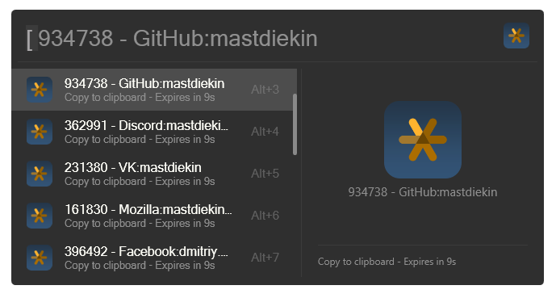

<p align="center">
  <a href="https://github.com/mastdiekin/Flow.Launcher.Plugin.Totp/">
    
  </a>
</p>

# About

Easily generate TOTP codes from your Google Authenticator data directly within Flow Launcher. This plugin simplifies your multi-factor authentication process by allowing you to quickly access and copy TOTP codes without leaving your workflow. Secure, fast, and convenient, it's the perfect tool for managing your 2FA needs right from your launcher.




## Installation
1. Download plugin from Release
2. Extract it to `%APPDATA%\FlowLauncher\Plugins\`
3. Install dependencies:
```bash
cd Flow.Launcher.Plugin.Totp
pip install -r requirements.txt
```

## Usage

1. Add account  
Plugin support standard OTPAuth URI (starts with `otpauth://`) and Google Authenticator Export URI(starts with `otpauth-migration://`), you can paste it to the plugin settings input.  
You can use any QRCode scanner to resolve QRCode to link. Accounts with same key in the list will not be added!
You can also add manually by editing config file in `%APPDATA%\FlowLauncher\Plugins\Flow.Launcher.Plugin.Totp\OTPList.json`:
    ```json
    {
        "version": 1,
        "entries": [
            {
                "name": "Github: mastdiekin",
                "key": "otpauth://...",
                "is_encrypted": false
            },
            {
                "name": "Discord: mastdiekin",
                "key": "AQAAANCMnb1BFdARjHoAwE...",
                "is_encrypted": true
            }
        ]
    }
    ```
    Once the plugin loads the config again, **all unencrypted data will be encrypted**.

    1.1. If you have added links through the plugin settings (in the `Migration links` field), then after the first successful run, all keys will be encrypted on this device (and saved in `%APPDATA%\FlowLauncher\Plugins\Flow.Launcher.Plugin.Totp\OTPList.json`). For security reasons, you should clear the `Migration links` field (since it stores unprotected data)!

2. Delete accounts
There is no way to delete accounts by GUI.
You delete an account by editing the config file in `%APPDATA%\FlowLauncher\Plugins\Flow.Launcher.Plugin.Totp\OTPList.json`.

## Credits
[Idea](https://github.com/KawaiiZapic/PowertoysRunTOTP)

[Google Authentificator migration decoder](https://github.com/digitalduke/otpauth-migration-decoder/tree/master)